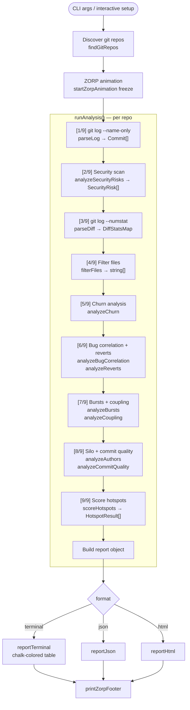
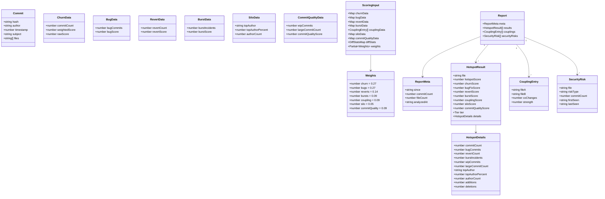
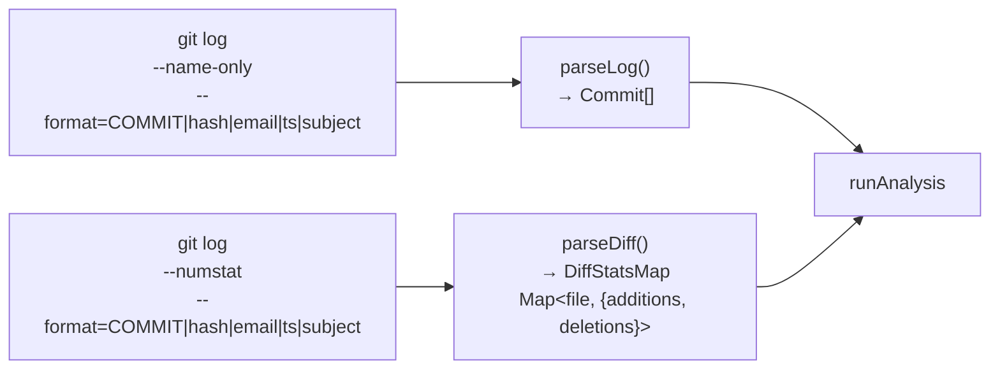
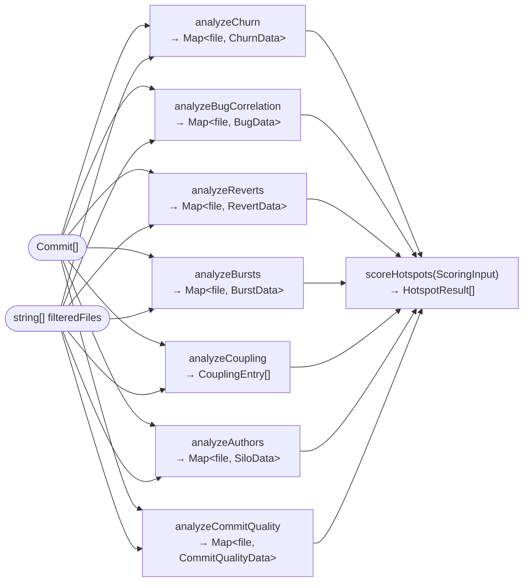

# Node.js Implementation — Architecture

The Node.js implementation lives in `node/`. It produces the same output as the Rust binary and shares the same CLI flags. Analyzers run sequentially (no worker threads), and git history is fetched in two separate subprocess calls.

## Module structure

```
node/
├── bin/
│   └── git-scanline.ts   CLI entry, main(), runAnalysis(), runInteractive()
├── src/
│   ├── types.ts           All shared TypeScript interfaces
│   ├── git/
│   │   ├── log-parser.ts      git log --name-only → Commit[]
│   │   ├── diff-parser.ts     git log --numstat  → DiffStatsMap
│   │   └── blame-analyzer.ts  Author concentration per file
│   ├── analyzers/
│   │   ├── churn.ts           Commit frequency + recency weighting
│   │   ├── bug-correlation.ts Subject keyword match
│   │   ├── revert-tracker.ts  Revert commit detection
│   │   ├── burst-detector.ts  Rapid-commit window detection
│   │   ├── coupling.ts        Co-change file coupling
│   │   ├── commit-quality.ts  WIP + oversized commits
│   │   └── security-check.ts  Sensitive filename detection
│   ├── scoring/
│   │   └── hotspot-scorer.ts  Weighted aggregation → HotspotResult[]
│   ├── filters/
│   │   └── file-filter.ts     Noise file exclusion
│   └── reporters/
│       ├── terminal.ts        Colored table output
│       ├── json.ts            JSON serialization
│       ├── html.ts            Self-contained HTML report
│       └── zorp-animation.ts  ZORP surfing mascot
```

## Analysis pipeline

The Node.js pipeline runs 9 sequential steps inside `runAnalysis()`.



> **Note:** Steps 6, 7, and 8 each call two analyzers back-to-back. Unlike the Rust version, these run sequentially — there is no parallel execution.

## Data types

All types in `node/src/types.ts` are camelCase mirrors of the Rust snake_case types.



## Git parsing — two invocations

Unlike the Rust version, Node.js makes two separate `git log` calls:



Both functions parse the same `COMMIT|hash|email|timestamp|subject` header format, switching between commits on that prefix and accumulating file data from the lines that follow.

## Analyzer outputs — data flow into scoring



## Scoring formula

```
hotspotScore =
    churnScore        × weights.churn         (default 0.27)
  + bugFixScore       × weights.bugs          (default 0.27)
  + revertScore       × weights.reverts       (default 0.14)
  + burstScore        × weights.bursts        (default 0.09)
  + couplingScore     × weights.coupling      (default 0.09)
  + siloScore         × weights.silo          (default 0.05)
  + commitQualityScore× weights.commitQuality (default 0.09)
```

**Tier thresholds** (same as Rust):

| Tier | Score |
|---|---|
| CRITICAL | ≥ 75 |
| HIGH | ≥ 50 |
| MEDIUM | ≥ 25 |
| LOW | < 25 |

## Differences from Rust implementation

| Aspect | Rust | Node.js |
|---|---|---|
| Git subprocesses | 1 (combined `--numstat`) | 2 (separate log + diff) |
| Analyzer execution | Parallel (`rayon::join`) | Sequential |
| Pipeline steps | 5 | 9 |
| Concurrency model | OS threads (rayon threadpool) | Single-threaded async |
| Type system | Structs + enums | TypeScript interfaces |
| Interactive loop | "Analyze another repo?" re-loop | One-shot, no re-loop |
| Animation handle | `ZorpHandle` with `freeze()`/`stop()` | `ZorpHandle` with `freeze()`/`stop()` |

## ZORP animation

`startZorpAnimation()` returns a `ZorpHandle` (same API as Rust):

| Method | Behaviour |
|---|---|
| `await handle.freeze()` | Leaves ZORP on screen; output appears below |
| `await handle.stop()` | Clears ZORP (used in interactive welcome screen) |
| `printZorpFooter()` | Prints a static ZORP frame as a report footer |
