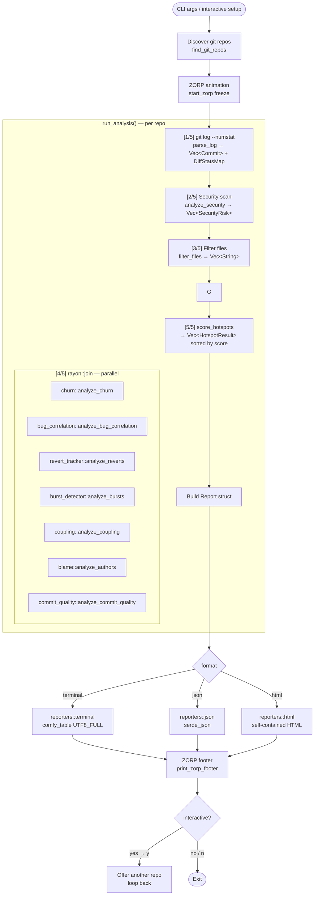
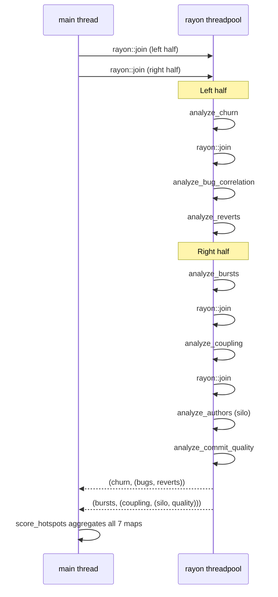
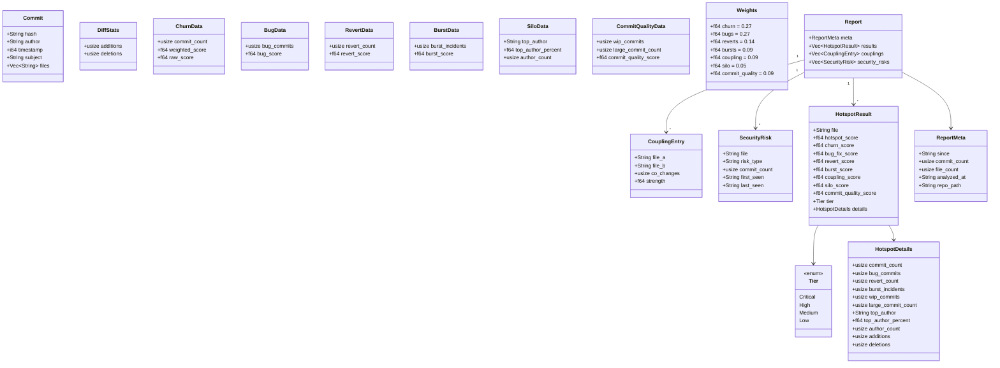
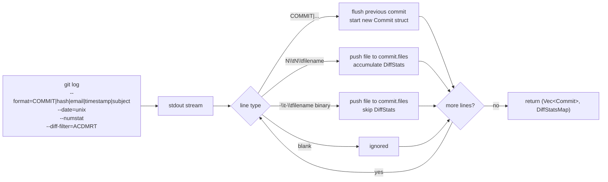
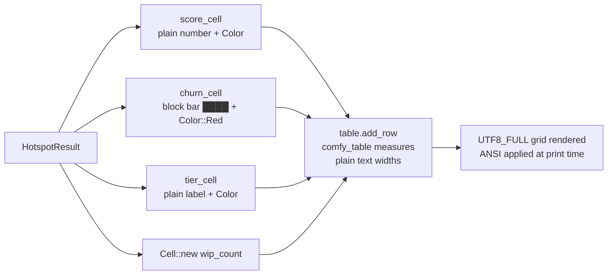

# Rust Implementation — Architecture

The Rust binary lives in `rust/`. It is the primary implementation, optimized for speed with a single git subprocess and parallel analyzer execution via `rayon`.

## Module structure

```
rust/src/
├── main.rs          CLI entry, main() loop, run_analysis() pipeline
├── types.rs         All shared data types
├── animation.rs     ZORP surfing mascot (start_zorp / freeze / stop)
├── scoring.rs       Weighted score aggregation → HotspotResult
├── filters/
│   └── mod.rs       File noise filter (globs, path prefixes)
├── git/
│   ├── mod.rs       Re-exports log_parser
│   └── log_parser.rs  Single git log --numstat invocation → (Vec<Commit>, DiffStatsMap)
├── analyzers/
│   ├── mod.rs
│   ├── churn.rs           Commit frequency + recency weighting
│   ├── bug_correlation.rs Commits whose subject matches bug/fix/hotfix keywords
│   ├── revert_tracker.rs  Commits that revert previous commits
│   ├── burst_detector.rs  Rapid-commit windows (many commits in short time)
│   ├── coupling.rs        Files that always change together (co-change analysis)
│   ├── blame.rs           Author concentration (silo risk)
│   ├── commit_quality.rs  WIP commits, oversized commits
│   └── security.rs        Sensitive filenames in git history (.env, keys, certs)
└── reporters/
    ├── terminal.rs  comfy_table UTF8_FULL table + colored output
    ├── json.rs      Serialized Report → stdout or file
    └── html.rs      Self-contained HTML report
```

## Analysis pipeline

The 5-step pipeline runs inside `run_analysis()` for each discovered repo.



## Parallel analyzer execution

All 7 analyzers read only immutable `&[Commit]` and `&[String]` references, so they satisfy `Send + Sync` without locks. `rayon::join` runs them in a binary tree to maximize CPU utilization.



## Data types



## Git parser — combined invocation

`log_parser::parse_log()` runs a single `git log` subprocess and returns both the commit list and per-file diff stats in one pass:



## Scoring formula

```
hotspot_score =
    churn_score          × weight.churn          (default 0.27)
  + bug_fix_score        × weight.bugs           (default 0.27)
  + revert_score         × weight.reverts        (default 0.14)
  + burst_score          × weight.bursts         (default 0.09)
  + coupling_score       × weight.coupling       (default 0.09)
  + silo_score           × weight.silo           (default 0.05)
  + commit_quality_score × weight.commit_quality (default 0.09)
```

All individual scores are normalized to a 0–100 scale before weighting.
Weights are normalized at runtime so that custom `--weight-*` values always sum to 1.

**Tier thresholds** (in `scoring.rs`):

| Tier | Score |
|---|---|
| Critical | ≥ 75 |
| High | ≥ 50 |
| Medium | ≥ 25 |
| Low | < 25 |

## Analyzers reference

| Analyzer | File | Input signal | Output |
|---|---|---|---|
| Churn | `analyzers/churn.rs` | Commit frequency + recency decay | `ChurnData` per file |
| Bug correlation | `analyzers/bug_correlation.rs` | Subject keyword match (fix, bug, hotfix, …) | `BugData` per file |
| Revert tracker | `analyzers/revert_tracker.rs` | Subject starts with "Revert" | `RevertData` per file |
| Burst detector | `analyzers/burst_detector.rs` | Multiple commits in a sliding time window | `BurstData` per file |
| Co-change coupling | `analyzers/coupling.rs` | Files changed in same commit | `Vec<CouplingEntry>` |
| Silo (blame) | `analyzers/blame.rs` | Author distribution across commits | `SiloData` per file |
| Commit quality | `analyzers/commit_quality.rs` | WIP subjects, oversized commit file counts | `CommitQualityData` per file |
| Security | `analyzers/security.rs` | Filename pattern (.env, *.pem, …) | `Vec<SecurityRisk>` |

## Terminal reporter — table rendering

The terminal reporter uses `comfy_table` with the `UTF8_FULL` preset. Cells are constructed with `Cell::new("plain text").fg(Color::X)` rather than pre-colored ANSI strings — this ensures `comfy_table` measures visible character widths correctly.



## ZORP animation

`animation::start_zorp()` returns a `ZorpHandle`. The handle enforces a minimum 1 600 ms display time.

| Method | Behaviour |
|---|---|
| `.freeze()` | Leaves ZORP on screen; output appears below it |
| `.stop()` | Clears ZORP from screen (interactive mode welcome) |
| `print_zorp_footer()` | Prints a static ZORP frame as a footer after all output |
